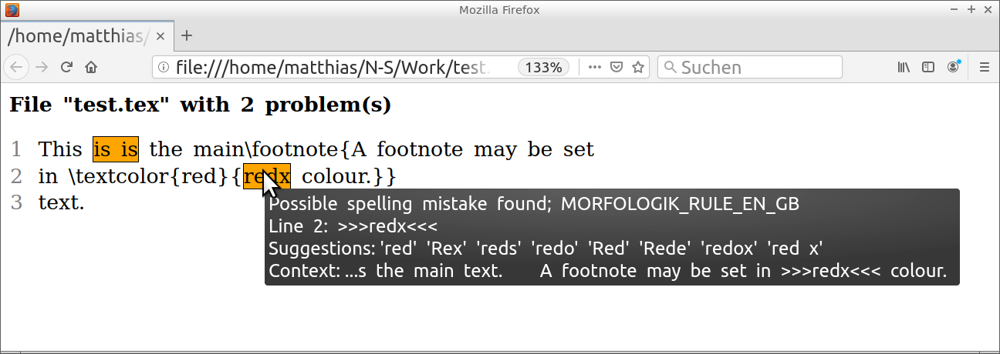

## Generation of an HTML report

Similarly to the scheme used by the tool
[TeXtidote](https://github.com/sylvainhalle/textidote),
the command
```
python3 shell2-html.py test.tex > test.html
```
with file 'test.tex' containing
```
This is is the main\footnote{A footnote may be set
in \textcolor{red}{redx colour.}}
text.
```
produces the following output 'test.html'.
Marked text regions correspond to problems indicated by the proofreading
software [LanguageTool](https://www.languagetool.org),
and related LanguageTool messages are displayed as tooltips.
The HTML report does not show the full text, but only includes
context regions of problematic text parts;
see the description in [README.md](README.md#application-examples).



