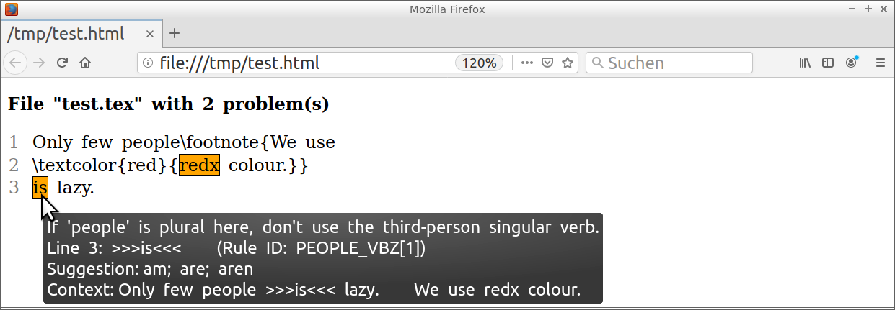

# Tex2txt: a flexible LaTeX filter
[General description](#general-description)&nbsp;\|
[Principal limitations](#principal-limitations)&nbsp;\|
[Selected actions](#selected-actions)&nbsp;\|
[Command line](#command-line)&nbsp;\|
[Usage under Windows](#usage-under-windows)&nbsp;\|
[Tool integration](#tool-integration)&nbsp;\|
[Encoding problems](#encoding-problems)&nbsp;\|
[Declaration of LaTeX macros](#declaration-of-latex-macros)&nbsp;\|
[Handling of displayed equations](#handling-of-displayed-equations)&nbsp;\|
[Application as Python module](#application-as-python-module)&nbsp;\|
[Remarks on implementation](#remarks-on-implementation)

**Summary and example.**
This Python program extracts plain text from LaTeX documents.
Due to the following characteristics, it may be integrated with a
proofreading software:
- tracking of line numbers or character positions during text manipulations,
- simple inclusion of own LaTeX macros and environments with tailored
  treatment,
- careful conservation of text flows,
- detection of trailing interpunction in equations,
- proper handling of nestable LaTeX elements like {} braces.

For instance, the LaTeX input
```
Only few people\footnote{We use
\textcolor{red}{redx colour.}}
is lazy.
```
will lead to the subsequent output from example application script
[shell.py](shell.py) described in section
[Application examples](#application-examples) ahead.
The script invokes [LanguageTool](https://www.languagetool.org)
as proofreading software, using a local installation or the Web server
hosted by LanguageTool.
```
1.) Line 2, column 17, Rule ID: MORFOLOGIK_RULE_EN_GB
Message: Possible spelling mistake found
Suggestion: red; Rex; reds; redo; Red; Rede; redox; red x
Only few people is lazy.    We use redx colour. 
                                   ^^^^
2.) Line 3, column 1, Rule ID: PEOPLE_VBZ[1]
Message: If 'people' is plural here, don't use the third-person singular verb.
Suggestion: am; are; aren
Only few people is lazy.    We use redx colour. 
                ^^
```
<a name="example-html-report"></a>
Run with option --html, the script produces an HTML report:



[Back to top](#tex2txt-a-flexible-latex-filter)

## General description
[Tex2txt.py](tex2txt.py) is a modest, self-contained
[Python](https://www.python.org)
script or module for the extraction of plain text from
[LaTeX](https://www.latex-project.org) documents.
In some sense, it relates to projects like
[OpenDetex](https://github.com/pkubowicz/opendetex),
[plasTeX](https://github.com/tiarno/plastex),
[pylatexenc](https://github.com/phfaist/pylatexenc),
[TeXtidote](https://github.com/sylvainhalle/textidote), and
[tex2txt](http://hackage.haskell.org/package/tex2txt).
For the naming conflict with the latter tool, we want to apologise.

While virtually no text should be dropped by the filter,
our aim is to provoke as few as possible “false” warnings when the result
is fed into a proofreading software.
The goal especially applies to documents containing displayed equations.
Problems with interpunction and case sensitivity would arise, if
equation environments were simply removed or replaced by fixed text.
Altogether, the script can help to create a compact report from language
examination of a single file or a complete document tree.
Simple and more complete applications are addressed in sections
[Tool integration](#tool-integration) and
[Application as Python module](#application-as-python-module) below.

For ease of problem localisation, we implement a mechanism that tracks
line number changes during the text manipulations.
Unnecessary creation of empty lines therefore can be avoided, sentences
and paragraphs remain intact.
This is demonstrated in file [Example.md](Example.md).
Reconstruction of both line and column numbers is possible with script
option --char, which activates position tracking for each single character
of input.
File [Example2.md](Example2.md) shows such an application.

The first part of the Python script gathers LaTeX macros and environments
with tailored treatment, which is shortly described
in section [Declaration of LaTeX macros](#declaration-of-latex-macros).
Some standard macros and environments are already included, but very probably
the collections have to be complemented.
With option --defs, definitions also can be extended by an additional file.

Unknown LaTeX macros and environments are silently ignored while keeping their
arguments and bodies, respectively; script option --unkn will list them.
Declared macros can be used recursively.
As in TeX, macro expansion consumes white space (possibly including a line
break) between macro name and next non-space character within the current
paragraph.

Extra text flows like footnotes are normally appended to the end of the
main text flow, each one separated by blank lines.
The introductory summary above shows an example.
Activation of this behaviour is demonstrated for macro \\caption{...}
in section [Declaration of LaTeX macros](#declaration-of-latex-macros).
Script option --extr provides another possibility that is also useful for
the extraction of foreign-language text.

An optional speciality is some parsing of LaTeX environments for displayed
equations.
Therefore, one may check embedded \\text{...} parts (macro from LaTeX package
amsmath), and trailing interpunction of these equations
can be taken into account during language check of the main text flow.
Further details are given in section
[Handling of displayed equations](#handling-of-displayed-equations).
An example is shown in file [Example.md](Example.md), operation is summarised
in the script at label LAB:EQUATIONS.

Interface and examples for application as Python module are described in
section [Application as Python module](#application-as-python-module) below.

The Python script may be seen as an exercise in application of regular
expressions.
Its internal design could be more orderly.
Currently, it is mainly structured by comments, and it mixes definitions of
variables and functions with statements that actually perform text replacement
operations.
Moreover, it uses many global variables without clear naming convention,
and some of them are even manipulated by the central module function.
In section [Remarks on implementation](#remarks-on-implementation),
some general techniques and problems are addressed.

If you use this tool and encounter a bug or have other suggestions
for improvement, please leave a note under category [Issues](../../issues),
or initiate a pull request.
Many thanks in advance.

Happy TeXing!

[Back to top](#tex2txt-a-flexible-latex-filter)

## Principal limitations
The implemented parsing mechanism can only roughly approximate the behaviour
of a real LaTeX system.
Apart from many minor shortcomings, a list of major incompatibilities
must contain at least the following points.

- Macro arguments, if any, have to be delimited by {} braces or \[\] brackets
  in text mode.
  This is perhaps the most severe restriction.
  Currently, only macros for text-mode accents form an exception.
- Mathematical material is represented by simple replacements.
- Parsing does not cross file boundaries. Tracking of file inclusions is
  possible though.
- Macros depending on (spacing) lengths may be treated incorrectly.
- Macro definitions in the text are ignored.
- Macros are not expanded in the order they appear in the text.
  We have tried to compensate related problems by several hacks.

Please compare section
[Remarks on implementation](#remarks-on-implementation), too.

[Back to top](#tex2txt-a-flexible-latex-filter)

## Selected actions
Here is a list of the most important script operations.

- flexible treatment of own macros with arbitrary LaTeX-style arguments;
  see section [Declaration of LaTeX macros](#declaration-of-latex-macros),
  and label LAB:MACROS in script
- “undeclared” macros are silently ignored, keeping their arguments
  with enclosing \{\} braces removed
- frames \\begin\{...\} and \\end\{...\} of environments are deleted;
  tailored behaviour for environment types listed in script:
  fixed environment replacement or removal, treatment of \\begin arguments
- text in heading macros as \\section\{...\} is extracted with
  added interpunction (suppresses false positives from LanguageTool)
- suitable placeholders for \\ref, \\eqref, \\pageref, and \\cite
- inline maths $...$ and \\(...\\) is replaced with text from rotating
  collection in variable parms.inline\_math in script, appending trailing
  interpunction from variable parms.mathpunct
- equation environments are resolved in a way suitable for check of
  interpunction and spacing, argument of \\text\{...\} is included into output
  text; \\\[...\\\] and $$...$$ are same as environment equation\*;
  see the section
  [Handling of displayed equations](#handling-of-displayed-equations),
  file [Example.md](Example.md), and LAB:EQUATIONS in script
- some treatment for specified \\item\[...\] labels, see LAB:ITEMS in script
- default \\item labels in enumerate environment are taken from rotating
  collection in script variable parms.default\_item\_enum\_labs
- letters with text-mode accents as '\\\`' or '\\v' are translated to 
  corresponding UTF-8 characters, see LAB:ACCENTS in script
- replacement of things like double quotes '\`\`' and dashes '\-\-' with
  corresponding UTF-8 characters;
  replacement of '\~' and '\\,' by UTF-8 non-breaking space and
  narrow non-breaking space
- on option --lang de: suitable replacements for macros like '"\`' and '"=',
  see variable parms.misc\_replace\_de in script
- treatment of \\verb(\*) macros and verbatim(\*) environments,
  see LAB:VERBATIM in script; note, however, [issue #6](../../issues/6)
- handling of % comments near to TeX: skipping of line break under certain
  circumstances, see LAB:COMMENTS in script
- rare warnings from proofreading program can be suppressed using \\LTadd{},
  \\LTskip{}, \\LTalter{}{} in the LaTeX text with suitable macro definition
  there; e.g., adding something that only the proofreader should see:
  \newcommand{\\LTadd}\[1\]{}

[Back to top](#tex2txt-a-flexible-latex-filter)

## Command line
The script expects the following parameters.
```
python3 tex2txt.py [--nums file] [--char] [--repl file] [--defs file]
                   [--extr list] [--lang xy] [--ienc enc] [--unkn]
                   [texfile]
```
- without positional argument `texfile`:<br>
  read standard input
- option `--nums file`:<br>
  file for storing original position numbers;
  if option --char not given: for each line of output text, the file contains
  a line with the estimated original line number;
  can be used later to correct line numbers in messages
- option `--char`:<br>
  activates character position tracking; if option --nums is given, then
  the file contains the estimated input position for each character of output
- option `--repl file`:<br>
  file with phrase replacements performed at the end, for instance after
  changing inline maths to text, and German hyphen "= to - ;
  see LAB:SPELLING in script for line syntax
- option `--defs file`:<br>
  file with additional declarations, example file content (defs members,
  given without lambda, are “appended” to corresponding parms members;
  compare section
  [Declaration of LaTeX macros](#declaration-of-latex-macros)):<br>
  `defs.project_macros = (Macro(name='swap', args='AA', repl=r'\2\1'),)`
- option `--extr ma[,mb,...]` (comma-separated list of macro names):<br>
  extract only first braced argument of these macros;
  useful, e.g., for check of foreign-language text and footnotes,
  or for tracking of file inclusions
- option `--lang xy`:<br>
  language de or en, default: de;
  used for adaptation of equation replacements, maths operator names,
  proof titles, for handling of macros like \"\=, and for replacement
  of foreign-language text;
  see LAB:LANGUAGE in script
- option `--ienc enc`:<br>
  encoding for LaTeX input and file from option --repl, default is UTF-8;
  Python code in file from option --defs is fixed to UTF-8
- option `--unkn`:<br>
  print list of undeclared macros and environments outside of equations;
  declared macros do appear here, if a mandatory argument is missing
  in input text

[Back to top](#tex2txt-a-flexible-latex-filter)

## Usage under Windows
If Python is installed under Windows, then the main Python
program [tex2txt.py](tex2txt.py) may be directly used in a Windows command
console or script.
Furthermore, at least the application script [shell.py](shell.py) from section
[Application examples](#application-examples) can be run,
if option '--server lt' is used, or if Java and the LanguageTool software
are locally present.
For example, this could look like
```
py -3 shell.py --html t.tex > t.html
```
or
```
"c:\Program Files\Python\Python37\python.exe" shell.py --html t.tex > t.html
```
if the Python launcher has not been installed.
The file tex2txt.py should reside in the current directory.
Variable 'ltdirectory' in script shell.py has to be customised, unless option
'--server lt' is used.

The software has been developed under Linux and additionally tested under
Cygwin on Windows&nbsp;7.
In the latter case, a Windows Java installation is sufficient.
Some possible encoding problems related to Windows are addressed in
section [Encoding problems](#encoding-problems).

[Back to top](#tex2txt-a-flexible-latex-filter)

## Tool integration
The Python script is meant as small utility that performs a limited task
with good quality.
Integration with a proofreading software and features like tracking of
\\input{...} directives have to be implemented “on top”.
Apart from application in Bash scripts, extension is also possible like
in section [Application as Python module](#application-as-python-module).

### Simple scripts
A first Bash script that checks a single LaTeX file is given in
file [shell.sh](shell.sh).
The command
```
bash shell.sh file_name
```
will read the specified LaTeX file and create plain text and line number
files with additional extensions .txt and .lin, respectively.
Then it will call [LanguageTool](https://www.languagetool.org)
and filter line numbers in output messages.
File [Example.md](Example.md) demonstrates the script.

A variant correcting both line and column numbers is given in
file [shell2.sh](shell2.sh) with application example in file
[Example2.md](Example2.md).

We assume that [Java](https://java.com) is installed, and that the directory
with relative path ../LT/ contains an unzipped archive of the LanguageTool
software.
This archive, for example LanguageTool-4.4.zip, can be obtained
from [here](https://www.languagetool.org/download).

### More complete integration
A Bash script for language checking of a whole document tree is proposed
in file [checks.sh](checks.sh).
For instance, the command
```
bash checks.sh Banach/*.tex > errs
```
will check the main text and extracted foreign-language parts in all these
files.
The result file 'errs' will contain names of files with problems together
with filtered messages from the proofreader.

With option --recurse, file inclusions as \\input{...} will be tracked
recursively.
Exceptions are listed at LAB:RECURSE in the Bash script.
Note, however, the limitation sketched in [issue #12](../../issues/12).

It is assumed that the Bash script is invoked at the “root directory”
of the LaTeX project, and that all LaTeX documents are placed directly there
or in subdirectories.
For safety, the script will refuse to create auxiliary files outside of
the directory specified by variable $txtdir (see below).
Thus, an inclusion like \\input{../../generics.tex}
probably won't work with option --recurse.

Apart from [Python](https://www.python.org),
the [Bash](https://www.gnu.org/software/bash) script
uses [Java](https://java.com) together with
[LanguageTool's](https://www.languagetool.org)
desktop version for offline use,
[Hunspell](https://github.com/hunspell/hunspell),
and some standard [Linux](https://www.linux.org) tools.
Before application, variables in the script have to be customised.
For placement of intermediate text and line number files, the script uses an
auxiliary directory designated by variable $txtdir.
This directory and possibly necessary subdirectories will be created
without request.
They can be deleted with option --delete.

### Actions of the Bash script
- convert content of given LaTeX files to plain text, extract foreign-language
  parts
- call LanguageTool (or Hunspell on --no-lt) for native-language main text
- check foreign-language text using Hunspell
- only if variable $check\_for\_single\_letters set to 'yes':
  look for single letters, excluding abbreviations in script variable $acronyms
  (useful, for instance, in German)

### Usage of the Bash script
```
bash checks.sh [--recurse] [--adapt-lt] [--no-lt]
               [--columns] [--delete] [files]
```
- no positional arguments `files`:<br>
  use files from script variable $all\_tex\_files
- option `--recurse`:<br>
  track file inclusions; see LAB:RECURSE in script for exceptions
- option `--adapt-lt`:<br>
  prior to checks, back up LanguageTool's files spelling.txt (additional
  accepted words) and prohibit.txt (words raising an error), and append
  corresponding private files; see LAB:ADAPT-LT in script
- option `--no-lt`:<br>
  do not use LanguageTool but instead Hunspell for native-language checks;
  perform replacements from script variable $repls\_hunspell beforehand
- option `--columns`:<br>
  correct both line and column numbers in messages from LanguageTool
- option `--delete`:<br>
  only remove auxiliary directory in script variable $txtdir, and exit

[Back to top](#tex2txt-a-flexible-latex-filter)

## Encoding problems
For script [tex2txt.py](tex2txt.py), the encoding of LaTeX input may be set
with option --ienc; output encoding is fixed to UTF-8.
In application Python script [shell.py](shell.py) from section
[Application examples](#application-examples),
this corresponds to option --encoding.
The Bash scripts from section [Tool integration](#tool-integration)
currently expect plain ASCII or UTF-8 input.

Files with Windows style line endings (CRLF) are accepted, but the text
output will be Unix style (LF only), unless a Windows Python interpreter
is used.
The output filters as in Bash script [shell2.sh](shell2.sh) will work
properly, however.

Under Cygwin with Java from the Windows installation, LanguageTool will
produce Latin-1 output, even if option '--encoding utf-8' is specified.
Therefore, a translator to UTF-8 has to be placed in front of a Python filter
for line or column numbers.
This is shown in Bash function LTfilter() in file [checks.sh](checks.sh).
A similar approach is taken in example Python script [shell2.py](shell2.py).

With option --json, LanguageTool always delivers UTF-8 encoded text.
JSON output is used in application script [shell.py](shell.py).

Similarly, Python's version for Windows by default prints Latin-1 encoded
text to standard output.
As this ensures proper work in a Windows command console, we do not change it
for the example script shell.py when generating a text report.
On option --html, we enforce UTF-8 output in order to
determine the encoding of the generated HTML page.
The stand-alone script tex2txt.py will produce UTF-8 output, too.

[Back to top](#tex2txt-a-flexible-latex-filter)

## Declaration of LaTeX macros
The first section of the Python script consists of collections for
LaTeX macros and environments.
The central “helper function” Macro() declares a LaTeX macro, see the
synopsis below, and is applied in the collections
parms.project\_macros and parms.system\_macros.
Here is a short extract from the definition of standard LaTeX macros already
included.
(The lambda construct allows us to use variables and functions introduced
only later.)
```
parms.system_macros = lambda: (
    Macro('caption', 'OA', extr=r'\2'),         # extract to end of text
    Macro('cite', 'A', '[1]'),
    Macro('cite', 'PA', r'[1, \1]'),
    Macro('color', 'A'),
    Macro('colorbox', 'AA', r'\2'),
    Macro('documentclass', 'OA'),
    ...
```
Other collections, e.g. for LaTeX environments, use functions similar
to Macro().
Project specific extension of all these collections is possible with
option --defs and an additional Python file.
The corresponding collections there, for instance defs.project\_macros,
have to be defined using simple tuples without lambda construct;
compare the example in section [Command line](#command-line).

Synopsis of `Macro(name, args, repl='', extr='')`:
- argument `name`:
    - macro name without leading backslash
    - characters with special meaning in regular expressions, e.g. '\*',
      may need to be escaped; see for example declaration of macro \\hspace,
      and use only unreferenced groups \(?:...\), see \\renewcommand
- argument `args`:
    - string that encodes argument sequence
    - A: a mandatory \{...\} argument
    - O: an optional \[...\] argument
    - P: a mandatory \[...\] argument, see for instance macro \\cite
- optional argument `repl`:
    - replacement pattern, r'...\\d...' (d: single digit) extracts text
      from position d in args (counting from 1)
    - other escape rules: see escape handling at function myexpand();
      e.g., include a single backslash: repl=r'...\\\\...'
    - inclusion of % only accepted as escaped version r'...\\\\%...',
      will be resolved to % at the end by function before\_output()
    - inclusion of double backslash \\\\ and replacement ending with \\
      will be rejected
    - reference by r'\\d' to an optional argument will be refused
- optional argument `extr`:
    - append this replacement (specified as in argument repl) to the end
      of the main text, separated by blank lines

[Back to top](#tex2txt-a-flexible-latex-filter)

## Handling of displayed equations
Displayed equations should be part of the text flow and include the
necessary interpunction.
The German version of
[LanguageTool](https://www.languagetool.org) (LT)
will detect a missing dot in the following snippet.
For English texts, see the comments in section
[Equation replacements in English documents](#equation-replacements-in-english-documents)
ahead.
```
Wir folgern
\begin{align}
    a   &= b \\
    c   &= d
\end{align}
Daher ...
```
Here, 'a' to 'd' stand for arbitrary mathematical
terms (meaning: “We conclude \<maths\> Therefore, ...”).
In fact, LT complains about the capital “Daher” that should start a
new sentence.

### Trivial version
With the entry
```
    EnvRepl('align', repl=''),
```
in parms.environments of the Python script (but no 'align' entry in
parms.equation\_environments), the equation environment is simply removed.
We get the following script output that will probably cause a problem,
even if the equation ends with a correct interpunction sign.
```
Wir folgern
Daher ...
```

### Simple version
With the entry
```
    EquEnv('align', repl='  Relation'),
```
in parms.equation\_environments of the script, one gets:
```
Wir folgern
  Relation
Daher ...
```
Adding a dot '= d.' in the equation will lead to 'Relation.' in the output.
This will also hold true, if the interpunction sign is followed by maths space
or by macros as \\label and \\nonumber.

### Full version
With the entry
```
    EquEnv('align'),
```
we obtain (“gleich” means equal, and option --lang en will print “equal”):
```
Wir folgern
  U-U-U  gleich V-V-V 
  V-V-V  gleich W-W-W 
Daher ...
```
The replacements 'U-U-U' to 'W-W-W' are taken from the collection in script
variable parms.display\_math that depends on option --lang, too.
Now, LT will additionally complain about repetition of 'V-V-V'.
Finally, writing '= b,' and '= d.' in the equation leads to the output:
```
Wir folgern
  U-U-U  gleich V-V-V, 
  W-W-W  gleich X-X-X. 
Daher ...
```
The rules for this equation parsing are described at LAB:EQUATIONS
in the Python script.
They ensure that variations like
```
    a   &= b \\
        &= c.
```
and
```
    a   &= b \\
        &\qquad -c.
```
also will work properly.
In contrast, the text
```
    a   &= b \\
    -c  &= d.
```
will again produce an LT warning due to the missing comma after 'b',
since the script replaces both 'b' and '-c' by 'V-V-V' without
intermediate text.

In rare cases, manipulation with \\LTadd{} or \\LTskip{} may be necessary
to avoid false warnings from the proofreader.
See also file [Example.md](Example.md).

### Inclusion of “normal” text
In variant “Full version”, the argument of \\text\{...\}
(variable for macro name in script: parms.text\_macro) is directly copied.
Outside of \\text, only maths space like \\; and \\quad is considered as space.
Therefore, one will get warnings from the proofreading program, if subsequent
\\text and maths parts are not properly separated.
See file [Example.md](Example.md).

### Equation replacements in English documents
The replacement collection in variable parms.display\_math does not work well,
if single letters are taken as replacements, compare
[Issue #22](../../issues/22).
We now have chosen replacements as 'B-B-B' for German and English texts.

Furthermore, the English version of LanguageTool (like other proofreading
tools) rarely detects mistakenly capital words inside of a sentence;
they are probably considered as proper names.
Therefore, a missing dot at the end of a displayed equation is hardly found.
An experimental hack is provided by option --equation-punctuation of
application script [shell.py](shell.py) described in section
[Application examples](#application-examples).

[Back to top](#tex2txt-a-flexible-latex-filter)

## Application as Python module
The script can be extended with Python's module mechanism.
In order to use `import tex2txt`, this module has to reside in the same
directory as the importing script, or environment variable PYTHONPATH
has to be set accordingly.

### Module interface
The module provides the following central function.
```
(plain, nums) = tex2txt.tex2txt(latex, options)
```
Argument 'latex' is the LaTeX text as string, return element 'plain' is the
plain text as string.
Array 'nums' contains the estimated original line or character positions,
counting from one.
Negative values indicate that the actual position may be larger.
Argument 'options' can be created with class
```
tex2txt.Options(...)
```
that takes arguments similar to the command-line options of the script.
They are documented at the definition of class 'Options', see LAB:OPTIONS.
The parameters 'defs' and 'repl' for this class can be set using functions
tex2txt.read\_definitions(fn, enc) and tex2txt.read\_replacements(fn, enc),
both expecting 'None' or a file name as argument 'fn', and an encoding name
for 'enc'.

**Remark.**
Since the function tex2txt() modifies globals in its module, an application
must only run it once at each point in time.

Two additional functions support translation of line and column numbers
in case of character position tracking.
Translation is performed by
```
ret = tex2txt.translate_numbers(latex, plain, nums, starts, lin, col)
```
with strings 'latex' and 'plain' containing LaTeX and derived plain texts.
Argument 'nums' is the number array returned by function tex2txt(),
'lin' and 'col' are the integers to be translated.
Argument 'starts' has to be obtained beforehand by the call
```
starts = tex2txt.get_line_starts(plain)
```
and contains positions in string 'plain' that start a new line.
The return value 'ret' above is 'None', if translation was not successful.
On success, 'ret' is a small object.
Integers 'ret.lin' and 'ret.col' indicate line and column numbers, and
boolean 'ret.flag' equals 'True', if the actual position may be larger.

Finally, function
```
tex2txt.myopen(filename, encoding, mode='r')
```
is similar to standard function open(), but it requires an explicit encoding
specification and converts a possible exception into an error message.

### Application examples
The module interface is demonstrated in function main() that is activated
when running the script tex2txt.py directly.

Example Python script [shell.py](shell.py) will generate a proofreading report
in text or HTML format from filtering the LaTeX input and application of
[LanguageTool](https://www.languagetool.org) (LT).
On option '--server lt', LT's Web server is contacted.
Otherwise, [Java](https://java.com) has to be present, and
the path to LT has to be customised in script variable 'ltdirectory';
compare the corresponding comment in script.
Note that from version 4.8, LT does not fully support 32-bit systems any more.
File tex2txt.py should reside in the current directory, see also
the [beginning of this section](#application-as-python-module).
Both LT and the script will print some progress messages to stderr.
They can be suppressed with `python3 shell.py ... 2>/dev/null`.
```
python3 shell.py [--html] [--link] [--include] [--extract macros]
                 [--language lang] [--t2t-lang lang] [--encoding ienc]
                 [--replace file] [--define file] [--disable rules]
                 [--context number] [--skip regex]
                 [--single-letters accept] [--equation-punctuation mode]
                 [--server mode] [--textgears apikey] [--plain]
                 [--lt-options opts]
                 latex_file [latex_file ...] [> text_or_html_file]
```
Option names may be abbreviated.
Default option values are set at the Python script beginning.
- option `--html`:<br>
  generate HTML report; see below for further details
- option `--link`:<br>
  if HTML report : left-click on a highlighted text part opens Web link
  provided by LT
- option `--include`:<br>
  track file inclusions like \\input\{...\}; script variable
  'inclusion\_macros' contains list of the corresponding LaTeX macro names
- option `--language lang`:<br>
  language code as expected by LT, default: 'en-GB';
  first two letters are passed to tex2txt();
  currently, only 'de' and 'en' supported, but see --t2t-lang
- option `--t2t-lang lang`:<br>
  overwrite option for tex2txt() from --language
- option `--disable rules`:<br>
  comma-separated list of ignored LT rules, passed as --disable to LT;
  default: 'WHITESPACE\_RULE'
- option `--extract macros`:<br>
  only check arguments of the LaTeX macros whose names are given as
  comma-separated list; useful for check of foreign-language text,
  if marked accordingly
- option `--skip regex`:<br>
  skip files matching the given regular expression;
  useful, e.g., for exclusion of figures on option --include
- option `--context number`:<br>
  number of context lines displayed around each marked text region
  in HTML report; default: 2; negative number: display whole text
- option `--single-letters accept`:<br>
  check for single letters, accepting those in the patterns given as list
  separated by '\|';
  for instance `--singe-letters 'A|a|I|e.g.|i.e.||'` for an English text,
  where the trailing '\|\|' causes addition of equation replacements
  from script variable equation\_replacements;
  all characters except '\|' are taken verbatim, but '~' and '\\,' are
  interpreted as UTF-8 non-breaking space and narrow non-breaking space
- option `--equation-punctuation mode`:<br>
  experimental hack for check of punctuation after equations in English texts,
  compare section
  [Equation replacements in English documents](#equation-replacements-in-english-documents);
  abbreviatable mode values, indicating checked equation type:
  'displayed', 'inline', 'all';
  generates a message, if an element of an equation is not terminated
  by a dot '.' and at the same time is not followed by a lower-case word or
  another equation element, both possibly separated by a mark from ',;:';
  patterns for equations are given by script variables
  equation\_replacements\_display and equation\_replacements\_inline
  corresponding to variables parms.display\_math and parms.inline\_math
  in script tex2txt.py
- option `--server mode`:<br>
  use LT's Web server (mode is 'lt') or a local LT server (mode is 'my')
  - LT's server: address set in script variable 'ltserver';
    for conditions and restrictions, please refer to
    [http://wiki.languagetool.org/public-http-api](http://wiki.languagetool.org/public-http-api)
  - local server: if not yet running (only tested by check on localhost:8081),
    then start it according to script variable 'ltserver\_local\_cmd';
    will not be stopped at the end;
    additional server options can be passed with --lt-options;
    see also
    [http://wiki.languagetool.org/http-server](http://wiki.languagetool.org/http-server);
    may be faster than command-line tool used otherwise, especially for large
    number of LaTeX files
- option `--textgears apikey`:<br>
  use the TextGears server, see [https://textgears.com](https://textgears.com);
  language is fixed to American English;
  access key 'apikey' can be obtained on page
  [https://textgears.com/signup.php?givemethatgoddamnkey=please](https://textgears.com/signup.php?givemethatgoddamnkey=please),
  but key 'DEMO\_KEY' seems to work for short input;
  server address is given by script variable textgears\_server
- option `--plain`:<br>
  assume plain-text input: no evaluation of LaTeX syntax;
  cannot be used together with option --include or --replace
- option `--lt-options opts`:<br>
  pass additional options to LT;
  first character of argument 'opts' will be skipped and must not be '-';
  for instance: `--lt-options '~--languagemodel ../LT/Ngrams'`
- options `--encoding ienc`, `--replace file`, `--define file`:<br>
  like options --ienc, --repl, --defs described in section
  [Command line](#command-line)

**Dictionary adaptation.**
LT evaluates the two files 'spelling.txt' and 'prohibit.txt' in directory
```
.../LanguageTool-?.?/org/languagetool/resource/<lang-code>/hunspell/
```
Additional words and words that shall raise an error can be appended here.
LT version 4.8 introduced additional files 'spelling\_custom.txt' and
'prohibit\_custom.txt'.

**HTML report.**
The idea of an HTML report goes back to Sylvain Hallé, who developed
[TeXtidote](https://github.com/sylvainhalle/textidote).
Opened in a Web browser, the report displays excerpts from the original 
LaTeX text, highlighting the problems indicated by LT.
The corresponding LT messages can be viewed when hovering the mouse
over these marked places, see the
[introductory example](#example-html-report) above.
With option --link, Web links provided by LT can be directly opened with
left-click.
Script option --context controls the number of lines displayed
around each tagged region;
a negative option value will show the complete LaTeX input text.
If the localisation of a problem is unsure, highlighting will use yellow
instead of orange colour.
For simplicity, marked text regions that intertwine with other ones
are separately repeated at the end.
In case of multiple input files, the HTML report starts with an index.

**Simpler demonstration script.**
A simpler Python application is [shell2.py](shell2.py).
It resembles Bash script [shell2.sh](shell2.sh)
from section [Simple scripts](#simple-scripts),
but it accepts multiple inputs and does not create temporary files.

[Back to top](#tex2txt-a-flexible-latex-filter)

## Remarks on implementation
Parsing with regular expressions is fun, but it remains a rather coarse
approximation of the “real thing”.
Nevertheless, it seems to work quite well for our purposes, and it inherits
high flexibility from the Python environment.
A stricter approach could be based on software like
[plasTeX](https://github.com/tiarno/plastex)
or [pylatexenc](https://github.com/phfaist/pylatexenc).

In order to parse nested structures, some regular expressions are constructed
by iteration.
At the beginning, we hence check for instance, whether nested {} braces of
the actual input text do overrun the corresponding regular expression.
In that case, an error message is generated, and the variable
parms.max\_depth\_br for maximum brace nesting depth has to be changed.
Setting control variables for instance to 100 does work, but also increases
resource usage.

A severe general problem is order of macro expansion.
While TeX strictly evaluates from left to right, the order of treatment by
regular expressions is completely different.
Additionally, we mimic TeX's behaviour in skipping white space between
macro name and next non-space character.
This calls for hacks like the regular expression in variable skip\_space\_macro
together with the temporary placeholder in mark\_begin\_env.
It avoids that a macro without arguments consumes leading space inside of
an already resolved following environment.
Besides, that protects a line break, for instance in front of an equation
environment.
Another issue emerges with input text like '\\y{a\\z} b' that can lead
to the output 'ab', if macro \\z is expanded after macro \\y{...} taking an
argument.
The workaround inserts the temporary placeholder in variable mark\_deleted
for each closing } brace or \] bracket, when a macro argument is expanded.

Our mechanism for line number tracking relies on a partial reimplementation
of the substitution function re.sub() from the standard Python module
for regular expressions.
Here, the manipulated text string is replaced by a pair of this same string
and an array of integers.
These represent the estimated original line numbers of the lines in the
current text string part.
During substitution, the line number array is adjusted upon deletion or
inclusion of line breaks.
The tracking of character positions for option --char works similarly.

Since creation of new empty lines may break the text flow, we avoid it
with a simple scheme.
Whenever a LaTeX macro is expanded or an environment frame is deleted,
the mark from variable mark\_deleted is left in the text string.
At the very end, these marks are deleted, and lines only consisting
of space and such marks are removed completely.
This also means that initially blank lines remain in the text (except
those only containing a % comment).

Under category [Issues](../../issues), some known shortcomings are listed.
Additionally, we have marked several problems as BUG in the script.

[Back to top](#tex2txt-a-flexible-latex-filter)
